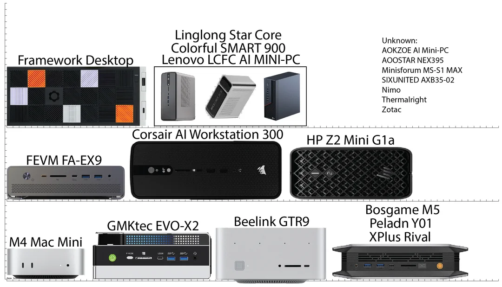
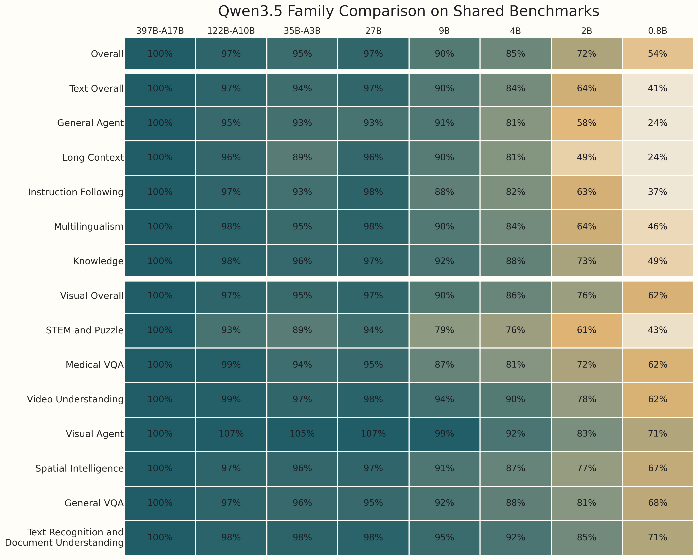
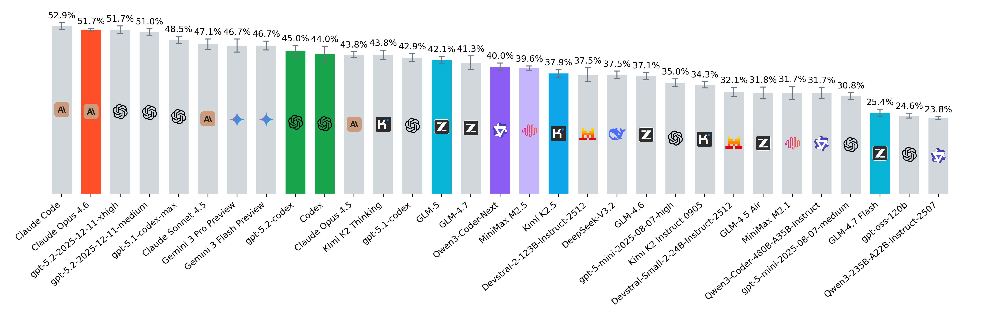
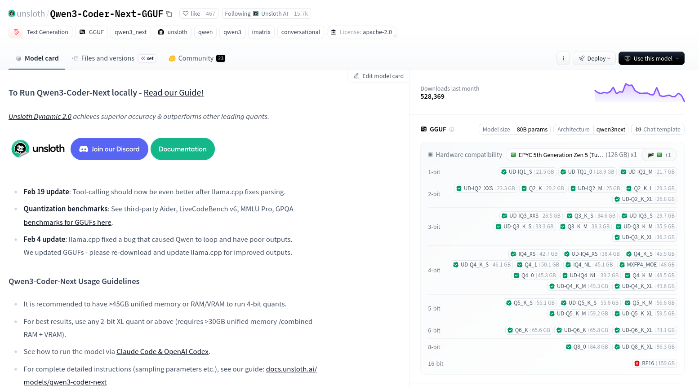

# RUN LOCAL AI

Quick update on how to run your own LLM/VLM and other AI applications:
opportunities and challenges.

> 2026-04-21 13:15-14:45 [90m],
> [BMN](https://www.ub.uni-leipzig.de/standorte/medizinnaturwissenschaften),
> Leipzig University Library, [Martin
> Czygan](https://www.linkedin.com/in/martin-czygan-58348842/)

## Today

Two parts.

* [ ] landscape of open LLMs and applications [10]
* [ ] install and try an application that lets us choose between different providers [35]

In a second part, we try to assess, what kind of work a local LLM can or cannot do:

* [ ] grammar checks, translations, summarization ("system prompt", "assistant")
* [ ] lightweight analysis ("coding")
* [ ] literature review ("analyzing documents")

Outlook, agentic systems.

* [ ] research assistant and coding help ("agent")

## Reminders, Disclaimers

* You will be using AI tools best, when you have developed an expertise in a subject. You may call it [KI-Fachkompetenzschwelle](https://barbarageyer.substack.com/p/ki-fachkompetenzschwelle).
* Overall, early adopters suffer more
* AI bubble ≠ AI

## Background

* [notes/2026-04-20-instructor.md](notes/2026-04-20-instructor.md)

## Why Local Models

* ownership vs renting
* a level of autonomy, control, privacy, predictability and freedom

[The Latent Role of Open Models in the AI
Economy](https://papers.ssrn.com/sol3/papers.cfm?abstract_id=5767103) (2025),
"Closed models dominate, with on average 80% of monthly LLM tokens using closed
models despite much higher prices — on average 6x the price of open models —
and only modest performance advantages"

> This systematic underutilization
is **economically significant**: reallocating demand from observably dominated
closed models to superior open models would reduce average prices by over 70%
and, when extrapolated to the total market, generate an **estimated $24.8
billion in additional consumer savings across 2025**.

## Why not

* usually less capable models (fewer parameters, quantized)
* you will need hardware (laptop, desktop), or access to hardware (server, data center)
* if you start from scratch, a useful setup may cost between EUR 1-8K (and since EOY25 we additionally have a full on [RAM crisis](https://en.wikipedia.org/wiki/2024%E2%80%93present_global_memory_supply_shortage))
* more initial setup, heterogeneous model landscape; early adopter pains

Some consumer market machines in 2026:

* [AMD Strix Halo APU](https://strixhalo.wiki/Guides/Buyer's_Guide) based
  systems, [Mac mini](https://www.apple.com/de/mac-mini/), [Mac
  Studio](https://www.apple.com/de/mac-studio/), anything with an [Nvidia
  GPU](https://en.wikipedia.org/wiki/List_of_Nvidia_graphics_processing_units)

Many models will run even on single board computers (e.g. raspberry pi, N150
based boards, ...), but just slowly; cf. [can i run?](https://www.canirun.ai/)

An example of performance regression caused by lower parameters counts
([source](https://old.reddit.com/r/LocalLLaMA/comments/1ro7xve/qwen35_family_comparison_on_shared_benchmarks/)):

A Strix Halo (128GB) box runs 122B-A10B (88GB) with PE/PP of 68/21 t/s.

### Evaluations

Capabilities are evaluated with benchmarks; examples:

* GPQA
* MMLU
* MMLU-Pro
* AIME 2025
* MATH
* HumanEval
* MMMU
* LiveCodeBench
* IFEval
* GSM8K
* SWE-Bench Verified

And thousands more; many are "saturated"; e.g. MMLU, HumanEval, BBH, DROP, MGSM, GSM8K, MATH, most old math benchmarks

* LiveBench: new questions every month from fresh sources, [livebench.ai](https://livebench.ai/#/?highunseenbias=true), [data](https://huggingface.co/collections/livebench/livebench),
* ARC-AGI-2: The Abstraction and Reasoning Corpus for Artificial General Intelligence benchmark measures an AI system's ability to efficiently learn new skills
* GPQA-Diamond: 198 grad-level science questions designed to be Google-proof. PhD experts score 65%. Starting to saturate at the top (90%+ for best reasoning models) but still useful
* SimpleQA: factual recall / hallucination detection. Less contaminated than older QA sets
* SWE-Bench Verified + Pro: real GitHub issues, real codebases
* HLE: humanities equivalent of GPQA
* MMMU: multimodal understanding where the image actually matters
* Tau-bench: tool-use reliability. Exposes how brittle most "agents" actually are
* LMArena w/ style control: human preference with the verbosity trick filtered out
* Scale SEAL: domain-specific (legal, finance)
* SciCode scientific coding
* HHEM: hallucination quantification

Example: [SciCode](https://scicode-bench.github.io/), SciCode: A Research Coding Benchmark Curated by Scientists, [dataset](https://huggingface.co/datasets/SciCode1/SciCode)

> SciCode is a challenging benchmark designed to evaluate the capabilities of
> language models (LMs) in generating code for solving realistic scientific
> research problems. It has a diverse coverage of 16 subdomains from 6 domains:
> Physics, Math, Material Science, Biology, and Chemistry. Unlike previous
> benchmarks that consist of exam-like question-answer pairs, SciCode is
> converted from real research problems ...

### Special Case: Software development

* [SWE-rebench: A Continuously Evolving and Decontaminated Benchmark for Software Engineering LLMs](https://swe-rebench.com/?insight=oct_2025)

While not at the top, Kimi K2 Thinking at **#12**, GLM-5 at **#14**, GLM-4.7 at
**#15** and Qwen3-Coder-Next at **#16**.

Note: A FP8 version of GLM-5 would require [860GB
VRAM](https://unsloth.ai/docs/models/glm-5)

Note: however a 128GB VRAM machine could run most versions of Qwen3-Coder-Next.

## Today

We will have a couple of options to run an LLM today.

* [x] "xs", a [single board computer](https://www.zimaspace.com/products/single-board-server#specs), 8GB RAM, 9W
* [x] "s", a [single board computer](https://www.zimaspace.com/products/single-board2-server#specs), 16GB RAM, 20W
* [x] "m", [20GB VRAM GPU](https://www.nvidia.com/content/dam/en-zz/Solutions/rtx-4000-sff/proviz-rtx-4000-sff-ada-datasheet-2616456-web.pdf), 70W
* [x] "l", unified [128GB RAM](https://www.amd.com/en/products/processors/laptop/ryzen/ai-300-series/amd-ryzen-ai-max-plus-395.html), 120W
* [x] "xl", NVIDIA [A100](https://www.nvidia.com/content/dam/en-zz/Solutions/Data-Center/a100/pdf/nvidia-a100-datasheet-nvidia-us-2188504-web.pdf), 300W

Let's go!

