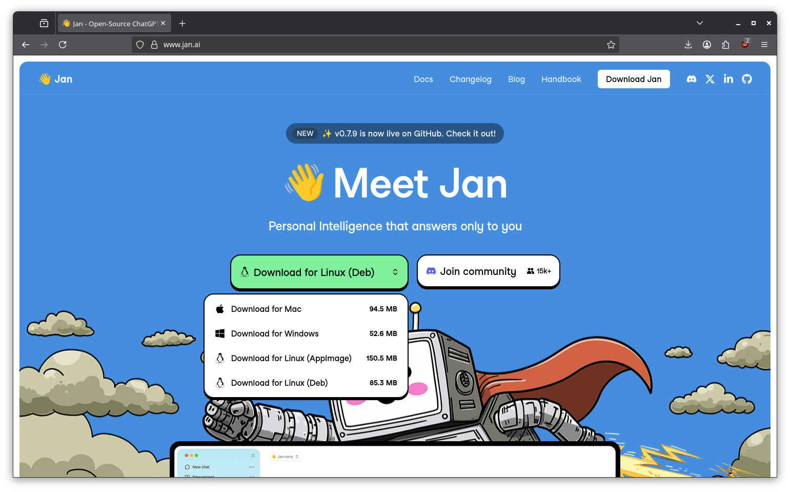
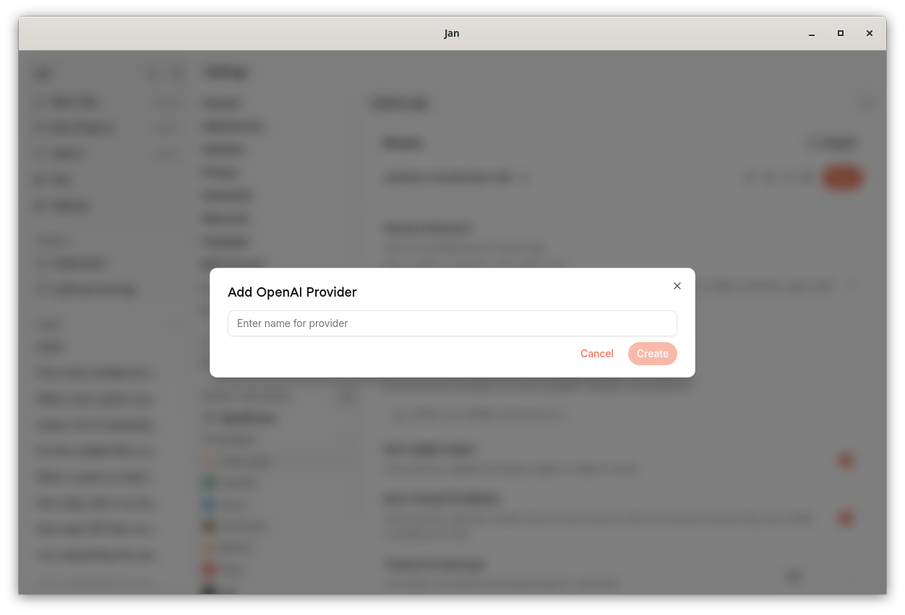
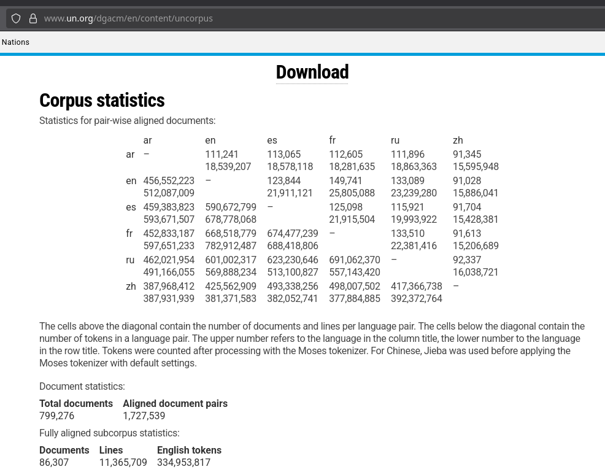
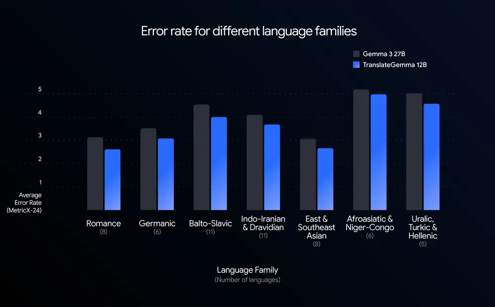
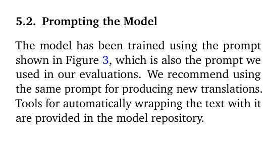
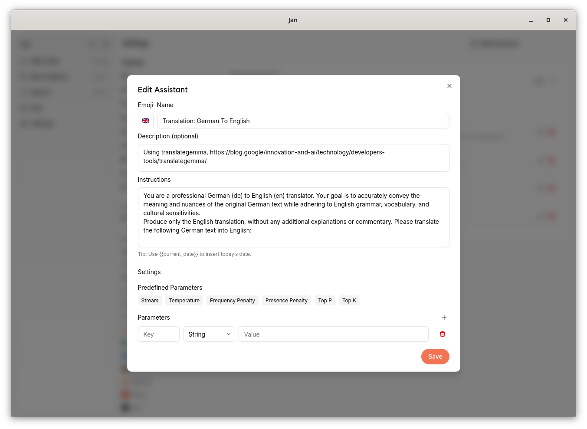
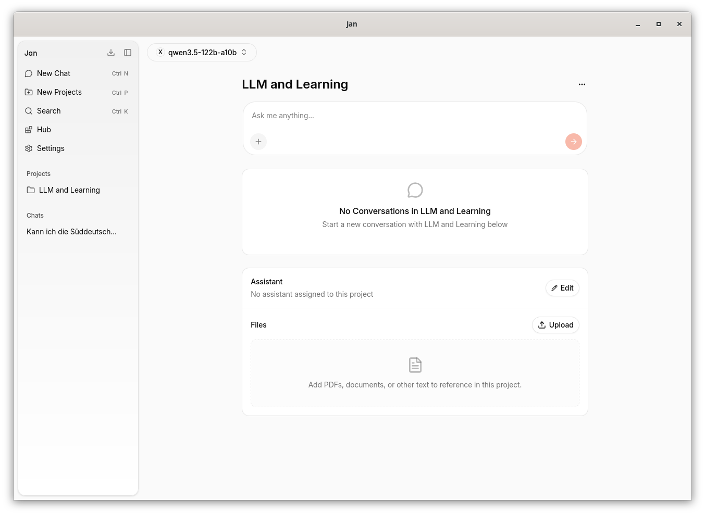
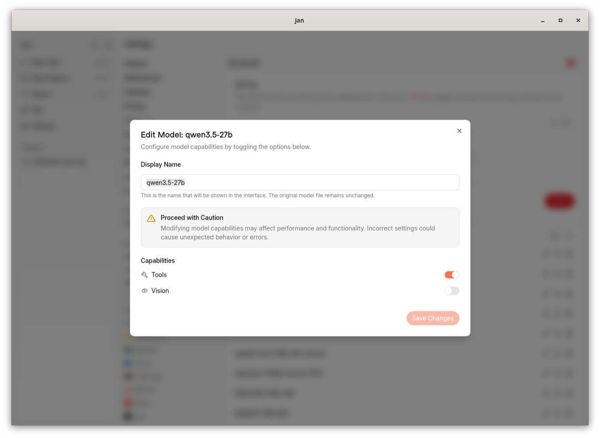
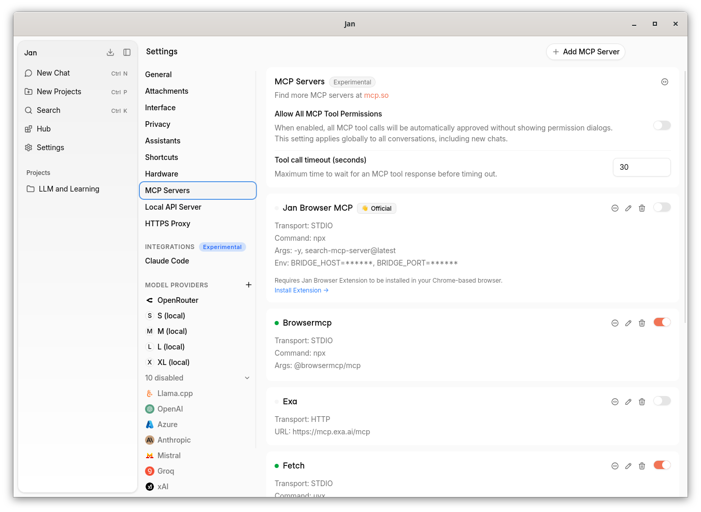
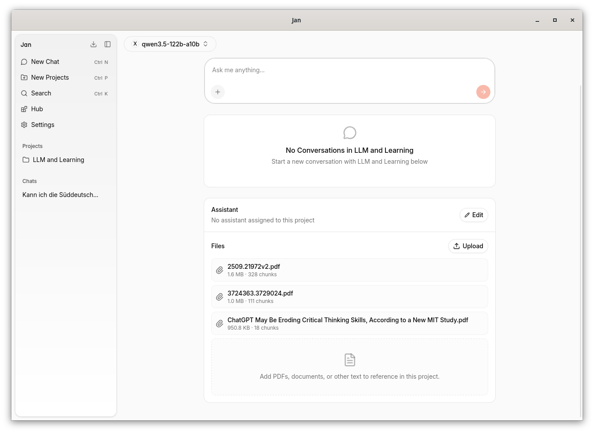

# RUN LOCAL AI

Quick update on how to run your own LLM/VLM with applications: opportunities
and challenges.

> 2026-04-21 13:15-14:45 [90m],
> [BMN](https://www.ub.uni-leipzig.de/standorte/medizinnaturwissenschaften),
> Leipzig University Library, [Martin
> Czygan](https://www.linkedin.com/in/martin-czygan-58348842/)

## Intro

### About You

Just a few questions, if I may ask.

#### Your LLM background

> How often do you reach to an LLM (or VLM, LMM, ...)?

* daily use: 9
* moderate: 5
* never: 1

#### Most used tool and interaction mode

> You tell me, there are many different combinations. Anything you like, or dislike?

* Claude Code in VS
* API / n8n / agentic
* Web: ChatGPT, Mistral, …
* Elicit
* Academic Cloud (Chat-AI)
* Zeitungskorpus / Würzburg / Impresso
* KI-Plugin Zotero, PDF durchsuchen

#### Any contact with the open weights ecosystem?

> Tried, tested, heard about?

* academic cloud
* huggingface
* blablador (HH)

### Outline

Two parts: Installation and Examples.

* [x] landscape of open LLMs and applications [10]
* [x] install and try an application that lets us choose between different providers [35]

In a second part, we try to assess, what kind of work a local LLM can or cannot do:

* [x] grammar checks, translations, summarization ("system prompt", "assistant")
* [x] lightweight analysis ("coding")
* [x] literature review ("analyzing documents")

Outlook, agentic systems.

* [x] research assistant and coding help ("agent")

### Reminders, Disclaimers

* You will be using AI tools best, when you have developed an expertise in a subject. You may call it [KI-Fachkompetenzschwelle](https://barbarageyer.substack.com/p/ki-fachkompetenzschwelle).
* Overall, early adopters suffer more
* AI bubble ≠ AI

### Background

* [notes/2026-04-20-instructor.md](notes/2026-04-20-instructor.md)

### Why Local Models

* ownership vs renting
* a level of autonomy, control, privacy, predictability and freedom

[The Latent Role of Open Models in the AI
Economy](https://papers.ssrn.com/sol3/papers.cfm?abstract_id=5767103) (2025),
"Closed models dominate, with on average 80% of monthly LLM tokens using closed
models despite much higher prices — on average 6x the price of open models —
and only modest performance advantages"

> This systematic underutilization
is **economically significant**: reallocating demand from observably dominated
closed models to superior open models would reduce average prices by over 70%
and, when extrapolated to the total market, generate an **estimated $24.8
billion in additional consumer savings across 2025**.

### Why not

* usually less capable models (fewer parameters, quantized)
* you will need hardware (laptop, desktop), or access to hardware (server, data center)
* if you start from scratch, a useful setup may cost between EUR 1-8K (and since EOY25 we additionally have a full on [RAM crisis](https://en.wikipedia.org/wiki/2024%E2%80%93present_global_memory_supply_shortage))
* more initial setup, heterogeneous model landscape; early adopter pains

Some consumer market machines in 2026:

* [AMD Strix Halo APU](https://strixhalo.wiki/Guides/Buyer's_Guide) based
  systems, [Mac mini](https://www.apple.com/de/mac-mini/), [Mac
  Studio](https://www.apple.com/de/mac-studio/), anything with an [Nvidia
  GPU](https://en.wikipedia.org/wiki/List_of_Nvidia_graphics_processing_units)

Many models will run even on single board computers (e.g. raspberry pi, N150
based boards, ...), but just slowly; cf. [can i run?](https://www.canirun.ai/)

An example of performance regression caused by lower parameters counts
([source](https://old.reddit.com/r/LocalLLaMA/comments/1ro7xve/qwen35_family_comparison_on_shared_benchmarks/)):

A Strix Halo (128GB) box runs 122B-A10B (88GB) with PE/PP of 68/21 t/s.

### Evaluations

Capabilities are evaluated with benchmarks; examples:

* GPQA
* MMLU
* MMLU-Pro
* AIME 2025
* MATH
* HumanEval
* MMMU
* LiveCodeBench
* IFEval
* GSM8K
* SWE-Bench Verified

And thousands more; many are "saturated"; e.g. MMLU, HumanEval, BBH, DROP, MGSM, GSM8K, MATH, most *old* math benchmarks

* LiveBench: new questions every month from fresh sources, [livebench.ai](https://livebench.ai/#/?highunseenbias=true), [data](https://huggingface.co/collections/livebench/livebench),
* ARC-AGI-2: The Abstraction and Reasoning Corpus for Artificial General Intelligence benchmark measures an AI system's ability to efficiently learn new skills
* GPQA-Diamond: 198 grad-level science questions designed to be Google-proof. PhD experts score 65%. Starting to saturate at the top (90%+ for best reasoning models) but still useful
* SimpleQA: factual recall / hallucination detection. Less contaminated than older QA sets
* SWE-Bench Verified + Pro: real GitHub issues, real codebases
* HLE: humanities equivalent of GPQA
* MMMU: multimodal understanding where the image actually matters
* Tau-bench: tool-use reliability. Exposes how brittle most "agents" actually are
* LMArena w/ style control: human preference with the verbosity trick filtered out
* Scale SEAL: domain-specific (legal, finance)
* SciCode scientific coding
* HHEM: hallucination quantification

Example: [SciCode](https://scicode-bench.github.io/), SciCode: A Research Coding Benchmark Curated by Scientists, [dataset](https://huggingface.co/datasets/SciCode1/SciCode)

> SciCode is a challenging benchmark designed to evaluate the capabilities of
> language models (LMs) in generating code for solving realistic scientific
> research problems. It has a diverse coverage of 16 subdomains from 6 domains:
> Physics, Math, Material Science, Biology, and Chemistry. Unlike previous
> benchmarks that consist of exam-like question-answer pairs, SciCode is
> converted from real research problems ...

Another more recent example: [FrontierSWE](https://www.frontierswe.com/)

### Special Case: Software development

* [SWE-rebench: A Continuously Evolving and Decontaminated Benchmark for Software Engineering LLMs](https://swe-rebench.com/?insight=oct_2025)

While not at the top, Kimi K2 Thinking at **#12**, GLM-5 at **#14**, GLM-4.7 at
**#15** and Qwen3-Coder-Next at **#16**.

Note: A FP8 version of GLM-5 would require [860GB
VRAM](https://unsloth.ai/docs/models/glm-5)

Note: however a 128GB VRAM machine could run most versions of Qwen3-Coder-Next.

## Using a desktop application

* Go to [www.jan.ai](https://www.jan.ai/) and **download the application for your platform**

* There are many modalities to access LLMs, web, desktop, command line, plugins, ...
* Matter of preference, integration

## Configuring Providers

* **Go to Settings > Model Providers** and then click the plus sign to add a new provider.

A model provider is an abstraction and API to interact with a language model.

We have a couple of options to run an LLM today. All of them are either under our control or belong to a trusted third party.

* [x] **"s"**, ~10+ models, a [single board computer](https://www.zimaspace.com/products/single-board2-server#specs), 16GB RAM, 20W
* [x] **"m"**, ~80+ models, desktop workstation, [20GB VRAM GPU](https://www.nvidia.com/content/dam/en-zz/Solutions/rtx-4000-sff/proviz-rtx-4000-sff-ada-datasheet-2616456-web.pdf), 70W
* [x] **"l"**, ~80+ models, desktop workstation, unified [128GB RAM](https://www.amd.com/en/products/processors/laptop/ryzen/ai-300-series/amd-ryzen-ai-max-plus-395.html), 120W
* [x] **"x"**, ~10+ models, data center, NVIDIA [A100](https://www.nvidia.com/content/dam/en-zz/Solutions/Data-Center/a100/pdf/nvidia-a100-datasheet-nvidia-us-2188504-web.pdf), 300W

The only option to set is the **Base URL** of the model. Those will be handed
out during the workshop. Once you typed in the correct URL, and pressed the
**reload** button, the application will automatically find and fill in the list
of the available models.

You can repeat this for all four providers.

Let's go!

## Application overview

* a language model is mostly a file, interaction with it served via API
* the application (here: Jan.ai) is a client, it facilitiates the requests to the API endpoint

> To try: choose **New Chat** and select a model from the providers; let's choose **gemma3:270m** (available on S, M, L)

* enter a prompt and send!

### What happens?

* the message is sent to the remote endpoint
* the LLM starts to calculate a probably next token
* it emits token after token
* the application receives the tokens and display them, as they arrive

## Notes on Model Selection

Usually two modes:

* [ ] official **benchmarks**, task **evaluations**
* [ ] a **vibe check**; does it work *for me*

Not perfectly correlated, a model with bad benchmarks may still be useful, and vice versa.

Some general notions:

* [ ] **number of parameters**; typically millions to billions, 100M to 800B; higher typically better; proprietary models may be in the 1T-2T range
* [ ] **architecture**: e.g. mixture of experts models require fewer resources
* [ ] **training style**; e.g. "instruct"
* [ ] **specializations**, e.g. "translations", "tool use", "coding", ...

## Application: Translation

You can use most models for translation these days, as parallel corpora are available for many languages, e.g. UN corpus and others.

Some specialized models exists and we want to look into one and learn about the concept of **assistants** in jan.ai desktop application.

### Translategemma

> Today, we're introducing TranslateGemma, a new collection of open translation
> models built on Gemma 3, helping people communicate across 55 languages, no
> matter where they are or what device they own. [Jan 15, 2026](https://blog.google/innovation-and-ai/technology/developers-tools/translategemma/)

Some models a trained with specific prompts and those can be used to get the best performance out:

> You are a professional {source_lang} ({src_lang_code}) to {target_lang}
> ({tgt_lang_code}) translator. Your goal is to accurately convey the meaning
> and nuances of the original {source_lang} text while adhering to
> {target_lang} grammar, vocabulary, and cultural sensitivities. Produce only
> the {target_lang} translation, without any additional explanations or
> commentary. Please translate the following {source_lang} text into
> {target_lang}:\n\n\n{text}

It would be tedious to repeat this text with every translation. This is what
**assisstants** are for, a way to fix a part of a prompt, sent along with every
request.

In Jan **Settings > Assistants**, click **Add Assitant** and fill in name and
instructions. There are a couple model parameters, which we skip for now.

## Application: Helpdesk

Prompt customization are the simplest way to change the behaviour of a model.

* create a new assistant for "helpdesk" trying to answer basic questions
* e.g. use the text from [digital newspapers](https://www.ub.uni-leipzig.de/recherche/elektronische-zeitungen)

## Application: Coding and Data Analysis

Sometime, the LLM is more helpful as an indirect assistant. E.g. if you want to
analyze some data, you may want to prompt and steer the model towards creating
a program that then solves your problem.

Live demo: Writing a Python script to print out the content of an Excel file.

## Excursion: Tool Use

Tool use is a vehicle to work around LLM limitations by using verified data at
query time to enhance LLM outputs. That can be many things:

* a database of snippets from documents
* web search
* reading a file
* listing directories

By default, tools are **not enabled** in Jan, as they can be a security risk. Use these at your own digression.

## Application: Document chat

* in jan, there is a notion of a project; an indexed set of documents (pdfs), that can be used to chat with

This may or may not work well, let's try a simple example:

* select a few PDF files (not too many for now, maybe at most three), **upload**
* wait a few minutes until the PDF is chopped up and indexed
* we pick a **qwen3.5-27b** from the "xl" provider
* we go to **Settings > Providers** and for the "xl" provider we edit the preferences for the model to **allow tool use**

This is important, as the retrieval of the snippets is a tool. The LLM may
freely choose other model, too, depending on **Settings > MCP Servers**.

> In my example, I choose 3 pdfs, with a total of 46 pages, it gets chopped into 457 chunks

Then, you can use normal chat and jan.ai will try to match your prompt to similar, hopefully relevant snippets of the PDFs.

## Wrap up and outlook

* local models can be an alternative, they iterate just as fast as propriatery models
* hardware is expensive, but there exists infrastructure to share in many research groups and organizations on various levels

### The agentic world

Since the release of [Claude
Code](https://en.wikipedia.org/wiki/Claude_(language_model)#Claude_Code) in
02/2025, agentic coding has been gaining popularity. It is a mode that is more
suitable for people already familiar with the command line.

It builds on the idea that you can put an LLM with tools into a loop and let
the LLM discover what it needs itself. Recently, since about 11/2025, frontier
model capabilities improved for agentic setup and it can be fascinating,
horrifying, dependent on your perspective.

Are you interested in a demo?

