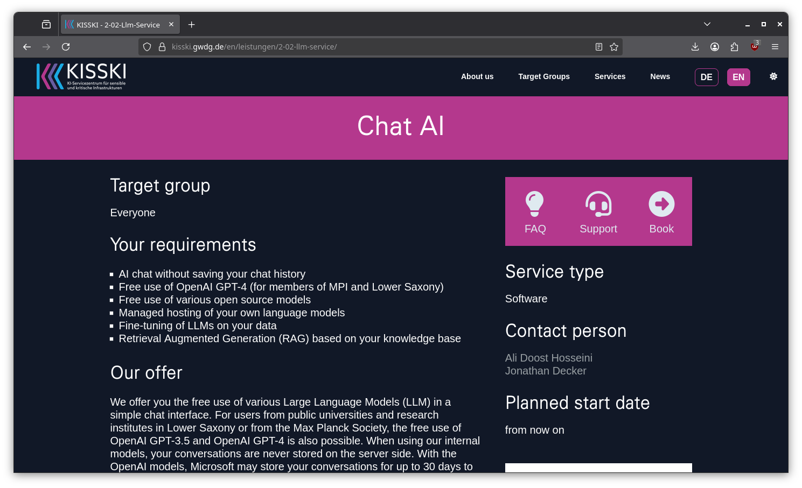
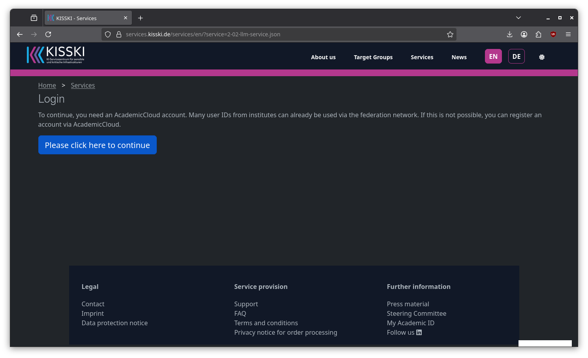
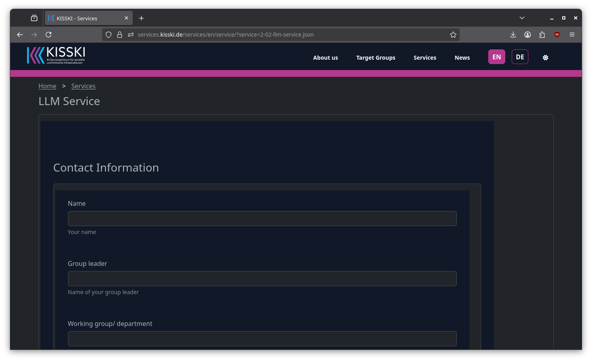
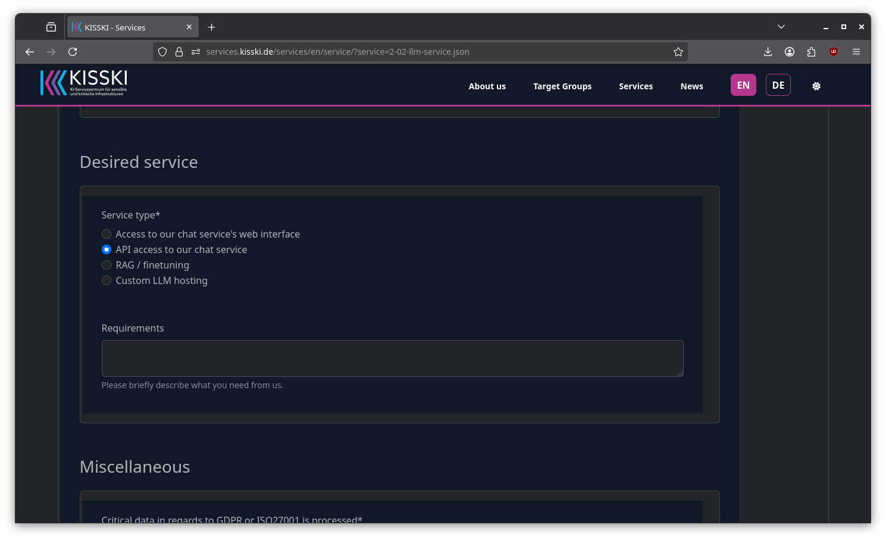
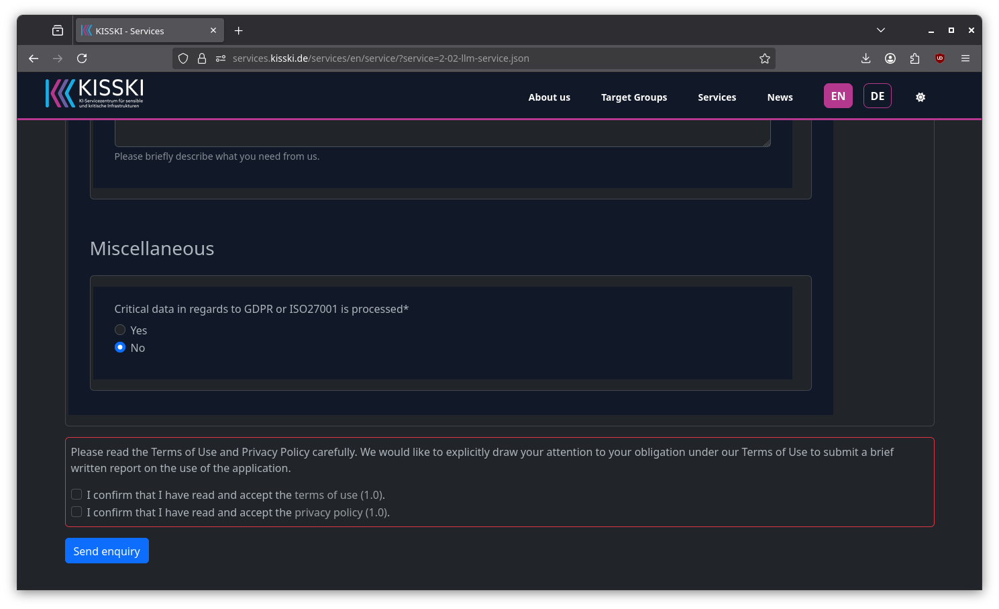
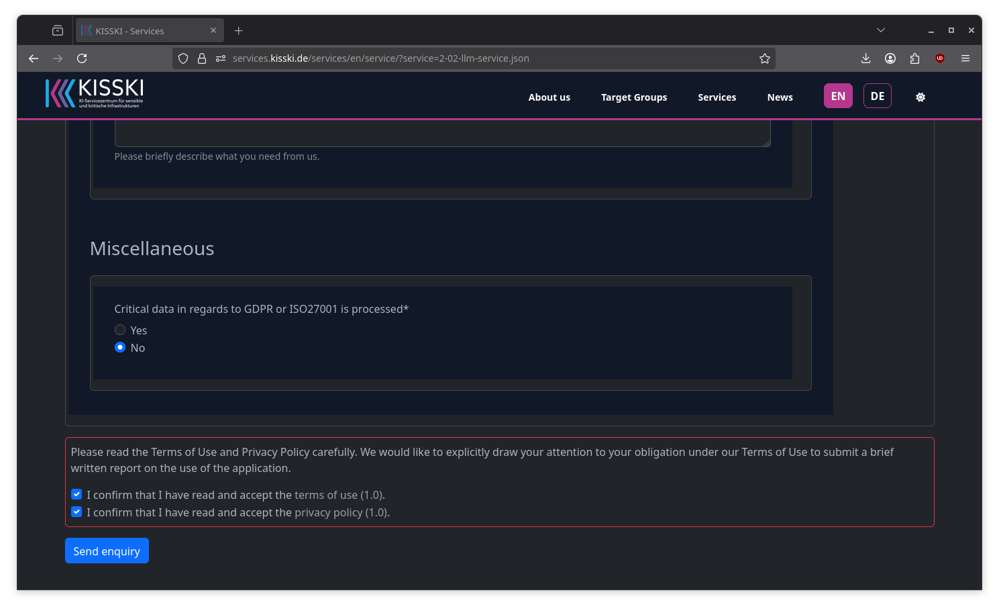

# CHAT AI API KEY

1. Go to [https://kisski.gwdg.de/en/leistungen/2-02-llm-service/](https://kisski.gwdg.de/en/leistungen/2-02-llm-service/) and click on "Book" ("Buchen").

2. If not logged in yet, you will be sent to a page that asks you to login with your institutional credentials.

3. After login, you will be redirected to a form. Fill out this form with you contact information.

4. As desired service choose **API access to our chat service** to request an API key.

5. Choose, whether you are processing sensible data. In general you can say "no" here.

6. Confirm Terms of Service and hit "Send inquiry" to finish the request.

You will receive an email that will contain your API key, which will likely look something like this:

> 98ea6e4f216f2fb4b69fff9b3a44842c

Keep this key in a secure place and do not share it.
